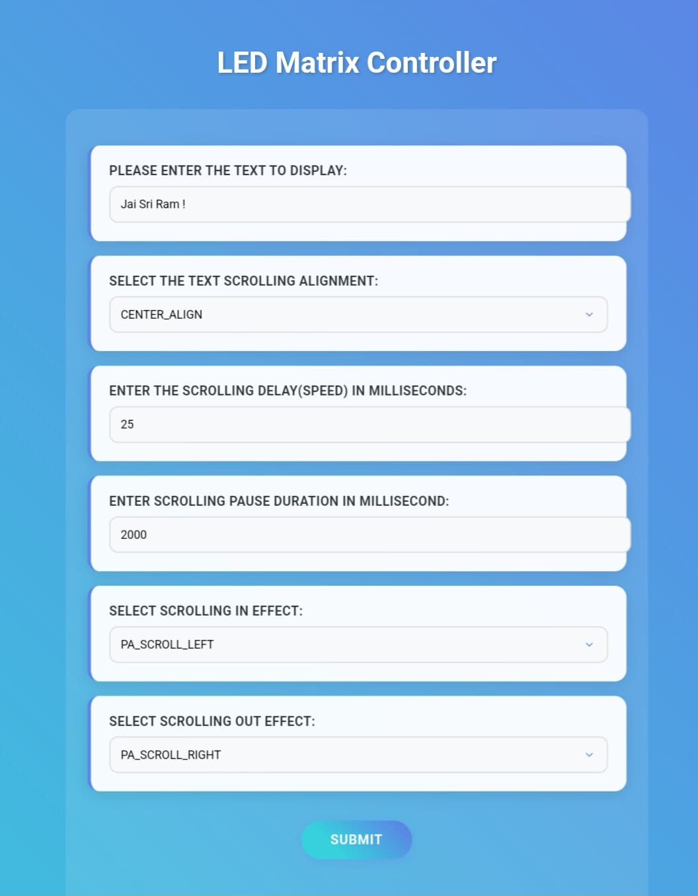

# MAX7219 Modular Advertising Display

## Overview
This project is a modular MAX7219-based advertising display that can be extended in size. It is powered by an ESP32, which hosts a web server with a user-friendly GUI. The GUI provides various configuration options, allowing users to customize the display content and behavior effortlessly.

## Features
- **Modular Design:** Easily extendable display size by adding more MAX7219 modules.
- **ESP32 Web Server:** Serves a GUI for configuring the display remotely.
- **Customizable Text:** Users can input custom text to be displayed.
- **Scrolling Alignment Options:** Choose different text alignment settings.
- **Adjustable Scrolling Speed:** Modify the speed at which text scrolls.
- **Scrolling Effects:** Various scrolling effects to enhance display aesthetics.

## Hardware Requirements
- ESP32 microcontroller
- MAX7219 LED matrix modules
- Power supply suitable for the number of modules used
- Connecting wires and/or PCB for wiring

## Software Requirements
- ESP-IDF or Arduino framework
- MAX7219 LED matrix control library ([MD_MAX72XX](https://github.com/MajicDesigns/MD_MAX72XX) and [MD_Parola](https://github.com/MajicDesigns/MD_Parola))
- Web server library for ESP32

## Setup Instructions
1. **Hardware Assembly:** Connect the MAX7219 modules in series and interface them with the ESP32.
2. **Firmware Installation:** Flash the ESP32 with the provided firmware.
3. **Accessing the GUI:** Connect to the ESP32's WiFi [ledmatrix.local] and open the web interface.
4. **Customization:** Use the GUI to configure text, scrolling behavior, and effects.
5. **Deployment:** Mount the display in the desired location and power it up.

## Usage
- Power on the ESP32 and ensure it connects to WiFi.
- Open a web browser and navigate to the ESP32-hosted GUI.
- Customize the display settings using the provided options.
- Save changes and observe the updates on the LED matrix.

## Future Enhancements
- Support for multiple fonts and text sizes
- MQTT/HTTP API for remote updates like showing local AQI and wheather info ect
- Additional animation effects

## Contributions
Contributions, bug reports, and feature requests are welcome! Feel free to submit a pull request or open an issue.

**Fig 1: MAX7219 webpage UI**

